# Librería JavaScript de Utilidades

## Portada

**Alumnos:** Francisco Javier González Santiago & Fredy Azarel Gomez Vasquez

**Proyecto:** Login en HTML y Javascript

### Descripción

Este proyecto consiste en un sistema de Logeo en el que se trabajo remotamente desde 2 computadoras diferentes, pero en
un mismo repositorio

Primero, en `login.html` se debe de validar 2 campos: correo y contraseña, una vez siendo validados 
correctamente, se envia `index.html`

Dentro de `index.html`, se tiene una navbar y una sidebar con un boton de anvorguesa, el cual despliega un menu con el
boton usuarios, este a su vez contiene un submenu con la opcion de alumnos

Dentro de la opcion alumnos, tenemos 2 formularios: uno para capturar un usuario con su nombre, correo y contraseña,
y otro para un registro de alumnos, en el cual se captura el numero de control, nombre completo y edad. Al ser
capturadas, se muestra un modal para verificar que el alumno sea mayor de edad

En la navbar se muestra el nombre de usuario con el correo que se haya iniciado sesion, y, al presionar el usuario
se muestra una opcion de cerrar sesion para volver a `login.html`

---

## Documentacion


**El framework CSS utilizado fue:**

**CSS3 personalizado** utilizando Flexbox y CSS Grid para la distribución de contenedores, lo que permite un control completo de las clases sin recargar dependencias externas.

Dentro de `login.html` primero deben de hacerse las validaciones en orden para poder iniciar la sesion y entrar a
`index.html`. Primero se valida el correo antes de entrar a la validacion de contraseña, si el correo no es correcto, no
se comienza a validar la contraseña. Una vez validado correo se avanza a validar contraseña, y hasta no ser validada
correctamente no se redirige a `index.html`.

Para enviar el nombre de usuario a el archivo `index.html` se usa la funcion de `sessionStorage`, para almacenar la
variable de correo y poder reutilizarla de nuevo llamandola con el mismo nombre que se guardo

```javascript
sessionStorage.setItem("usuarioLogueado", correo);
```

```javascript
const usuarioSesion = sessionStorage.getItem("usuarioLogueado") || "Usuario Invitado";
```

Los metodos principales usados son:
```javascript
function validarLogin(){

}
```
El cual es el que se encarga de las validaciones y manda a llamar a `libreria.js` para realizar las validaciones. 

```javascript
function validarCorreo(){

}
function validarPassword(){

}
function validarLongitud(){

}
```
Son las funciones para validar los campos necesarios para el login, y `validarLongitud` para validar el
numero de control en `index.html`

```javascript
if (formAlumno) {
    formAlumno.addEventListener("submit", (e) => {
    
    }
if (formUsuario) {
    formUsuario.addEventListener("submit", (e) => {
    
    }
```
Se usa para las validaciones de captura y de registro de alumnos en `index.html`

---

---

## Explicacion paso a paso

Para `login.html`
1. Primero se creo lo necesario para un html y esas cosas:
```javascript
<!DOCTYPE html>
<html lang="es">
```
2. Luego designamos espacios para cada campo, haciendo las divisiones con <div>
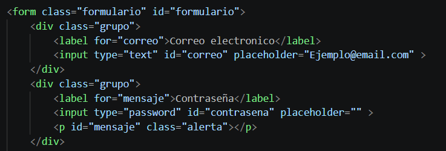
3. Le damos id y class, a todas las etiquetas para organizarlas y poder añadirles un estilo facilmente
4. Creamos el boton de tipo `submit` y le añadimos la funcion del archivo `login.js`

Para `login.js`
1. Primero, extraemos los campos necesarios que vayamos a ocupar dentro de nuestro js como `mensaje` o `formulario`
2. Le añadimos un eventListener al boton de tipo `submit` de `login.html` y creamos el escenario que puede tener
al encontrar un correo invalido 
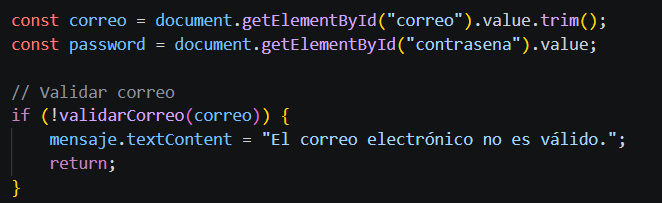
3. Luego creamos las validaciones para la contraseña, esta debe de mostrar los diferentes casos en los que le hagan
falta caracteres a la contraseña ingresada para que sea valida
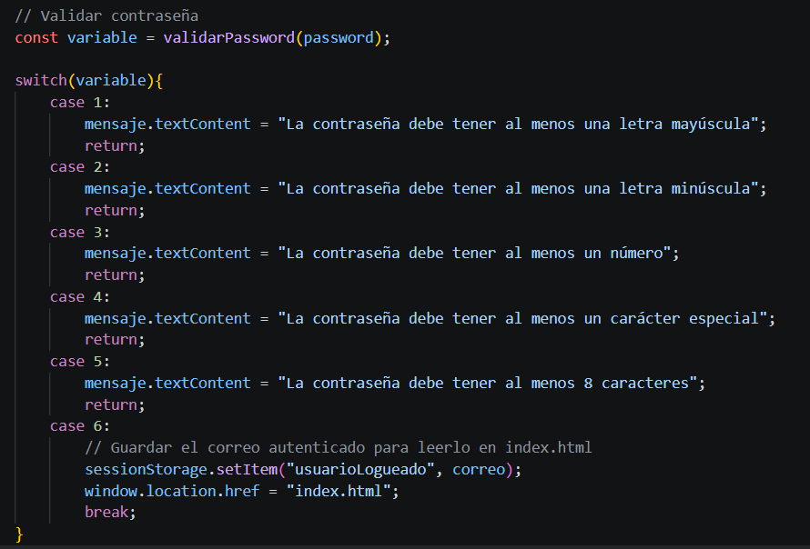

Para `sidebar`
1. Se estructuró dentro de una etiqueta `<aside>` con clase `.sidebar`, conteniendo las opciones para la navegación en listas no ordenadas como `<ul>` y  `<li>`.
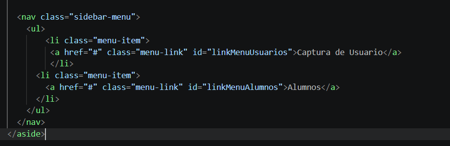
2. Se integró una clase `.collapsed` que oculta o muestra el panel lateral al interactuar con el botón hamburguesa del navbar.
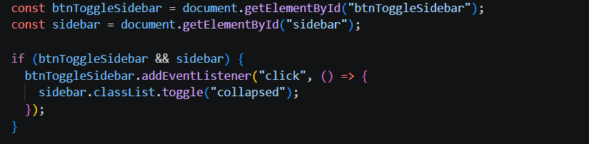
3. Los enlaces del menú se conectaron mediante eventos en `index.js` para alternar la visualización entre la pantalla de bienvenida y los formularios sin necesidad de recargar la página.

Para `navbar`
1. Se ubicó en la parte superior dentro de un contenedor `<header class="navbar">` distribuido con Flexbox (`justify-content: space-between`).
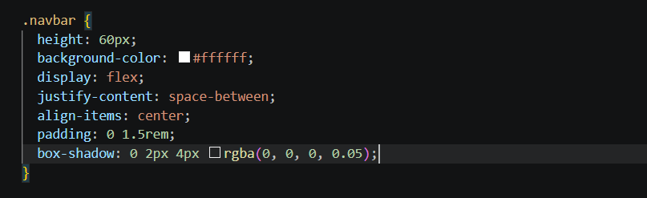
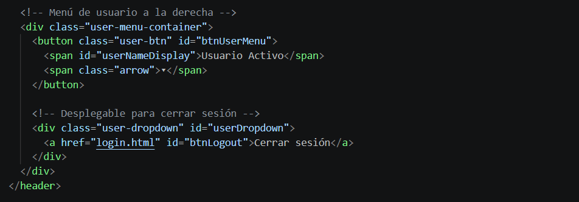
2. A la izquierda se integró el botón hamburguesa (`#btnToggleSidebar`), encargado de alternar la visibilidad del sidebar mediante un escuchador de eventos.
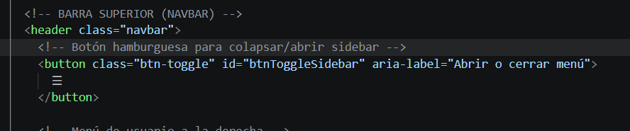
3. A la derecha se configuró un menú de usuario interactivo (`.user-menu-container`), el cual lee dinámicamente el correo almacenado en `sessionStorage` tras el inicio de sesión y lo muestra en `#userNameDisplay`.
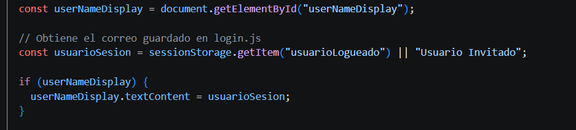
4. Al hacer clic sobre el nombre del usuario se despliega un dropdown (`.user-dropdown`) con la opción de **Cerrar sesión**, la cual elimina la clave `usuarioLogueado` de `sessionStorage` y redirige nuevamente a `login.html`.
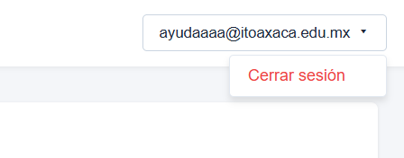

---

---

## Capturas de pantalla

A continuación se mostrarán capturas de pantalla que demuestran el funcionamiento del Login

### Login.html con campos vacios

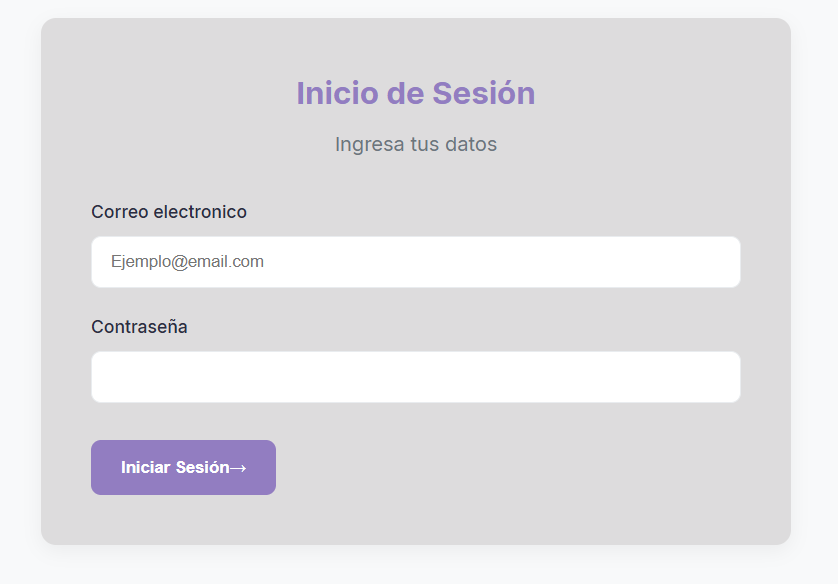

### Login.html con campos incorrectos

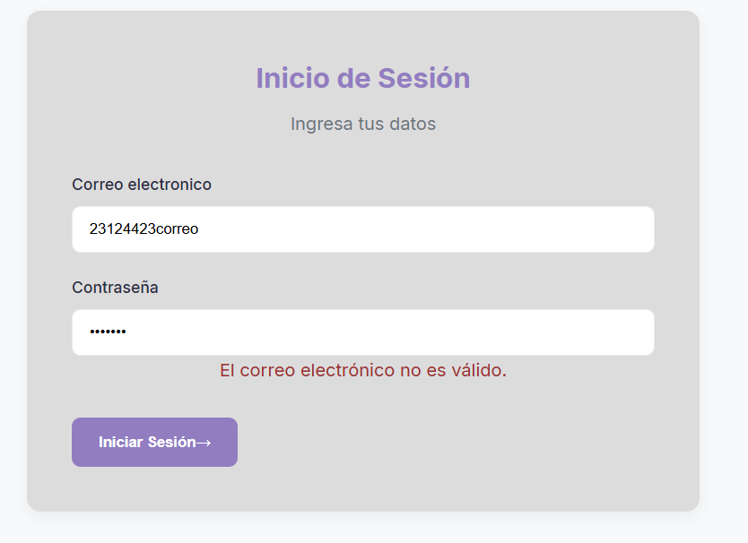

### Index.html

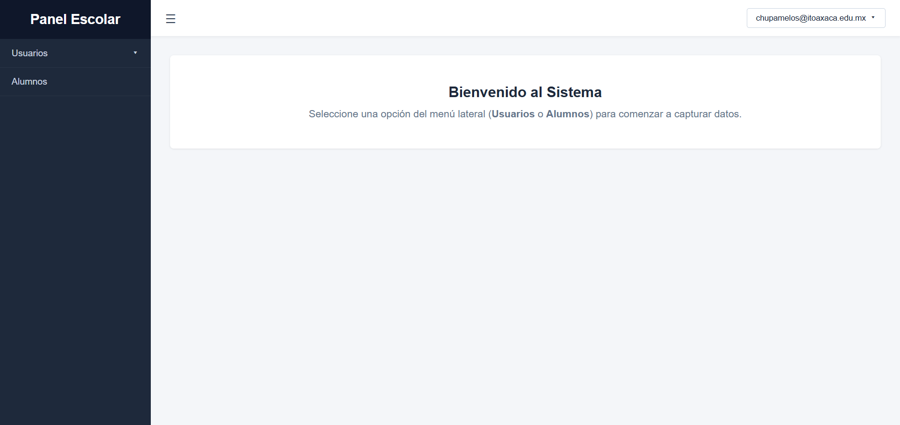

### Captura de Usuario

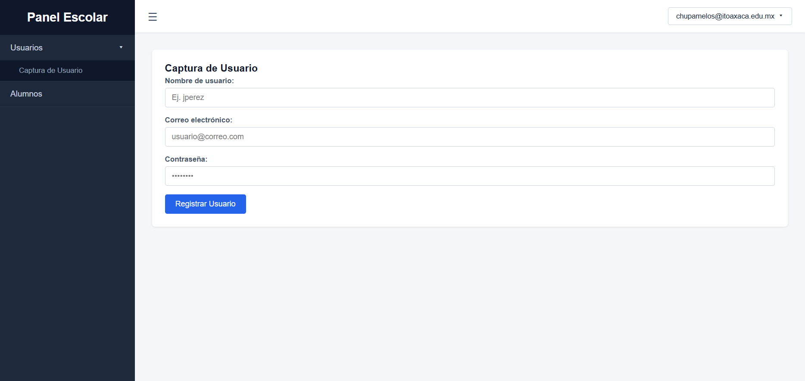

### Captura de Usuario correcta


### Registro de Alumnos

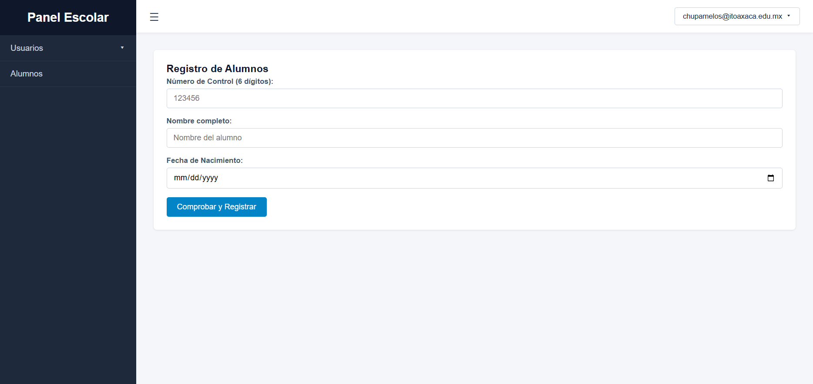

### Modal Edad

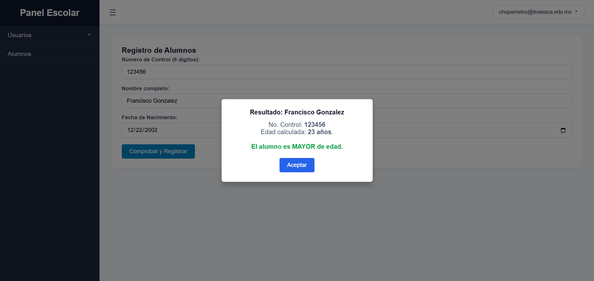

### Cerrar Sesion


---

Proyecto realizado para la materia de Programación Web.